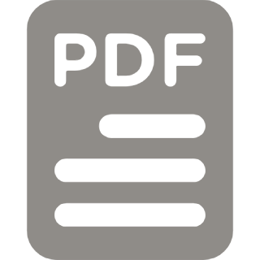

# Curriculum Vitae {#cv}
<h3 id="cv-updated">Updated December 2023</h3>

---

<a href="https://ivar-rydstrom.github.io/assets/content/Ivar_Rydstrom_CV_Public.pdf" class="no-mark-external bold" target="_blank">Download a PDF</a>

<iframe class="cv-pdf" src="https://docs.google.com/gview?url=https://ivar-rydstrom.github.io/assets/content/Ivar_Rydstrom_CV_Public.pdf&embedded=true" frameborder="0">Loading Now</iframe>
