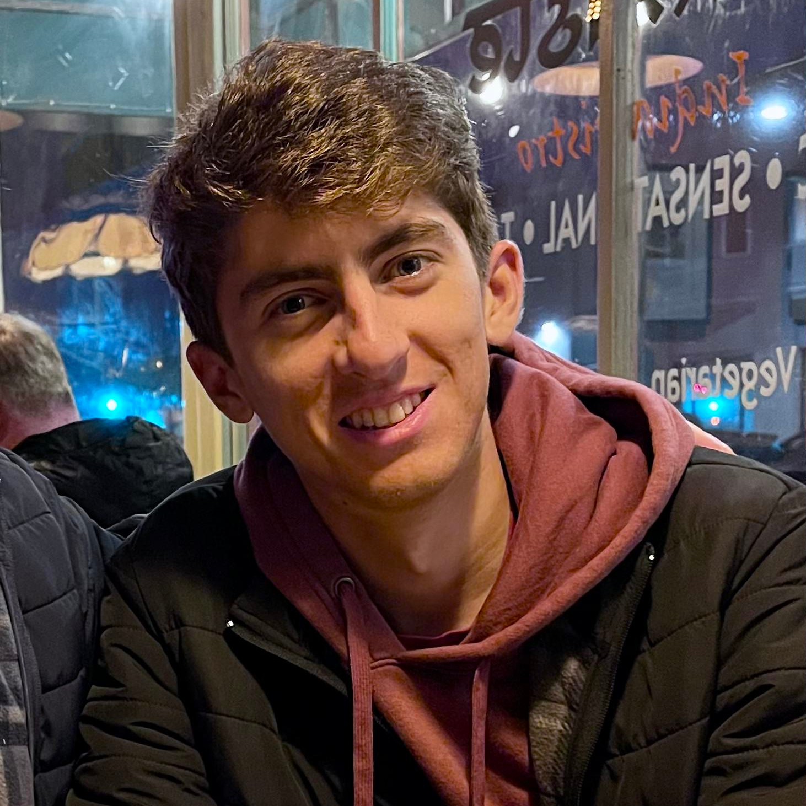
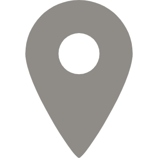
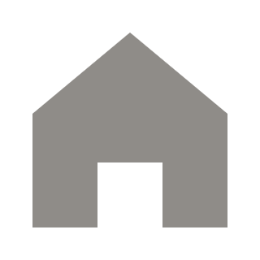
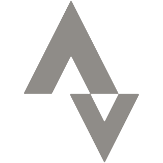

# Ivar Rydstrom

<h3 class="subtitle" style="margin-top: 0px">Physics Student</h3>

Hi, I'm Ivar. I'm a senior Engineering Physics student in the Honors College at [Santa Clara University](https://www.scu.edu/cas/physics/). Aside from physics, I'm also studying Mathematics and Computer Engineering as minors.

I'm the current president of the [Society of Physics Students](https://www.instagram.com/scu.sps/) chapter at SCU. Please reach out if you are interested in joining our community! I also do private physics tutoring at undergraduate and high school levels. [Find more information about my tutoring services here](/tutoring).

I'm currently based here in Northern California (South Bay), but I'm originally from Orange County. On the side, I race bikes competitively for [Team Mike's Bikes: Development](https://www.teammikesbikes.com/). You can occasionally catch me at Spectrum Ride or the SCU Triathlon Club ride on Saturday mornings!

## Research Interests

My research in physics falls in the realm of experimental particle astrophysics. In particular, I help to develop powerful low temperature detectors to search for dark matter. I currently work with [Dr. Betty Young](https://www.scu.edu/cas/physics/faculty/betty-a-young/) at SCU in her collaboration with [Dr. Noah Kurinsky](https://kipac.stanford.edu/people/noah-kurinsky-0) at [SLAC National Accelerator Laboratory](https://www6.slac.stanford.edu/) in the *Dark Matter and Quantum Information Science (DMQIS)* group. We develop novel superconducting quantum sensors for dark matter detection in our lab, *SLAC Millikelvin Facility (SMF)*.

Currently, I am most involved in developing room-temperature electronics for the [SPLENDOR project](/projects/filter-box#splendor), a prototype dark matter experiment that will use designer narrow-gap semiconductors to probe particle-like "light" dark matter of sub-Mev mass. Our two-stage High Electron Mobility Transistor (HEMT) amplifier is projected to achieve a charge-resolution of O(1e-). This ongoing experiment is a collaboration between various national laboratories that is committed to advancing the bleeding edge of ionization detector and charge-based readout technology.

{:.center-img style="width:65%"}
*DMQIS group underneath dilution refrigerator "OLAF" at SLAC, September 2023.*{:.caption}

 

# Connect with me {#contact}

    <ul>
        <li>
            

            
Santa Clara University Department of Physics, Santa Clara, California, 95050

        </li>
        <li>
            

            
irydstrom (at) scu (dot) edu
        
        </li>
        <li>
            

            <a href="https://ivar-rydstrom.github.io/" class="bold">ivar-rydstrom.github.io</a>
        </li>
        <li>
            

            <a href="https://www.linkedin.com/in/ivar-rydstrom/" class="bold">LinkedIn</a>
        </li>
        <li>
            

            <a href="https://github.com/Ivar-Rydstrom" class="bold">GitHub</a>
        </li>
        <li>
            

            <a href="https://www.strava.com/athletes/69009354" class="bold">Strava</a>
        </li>
    </ul>

